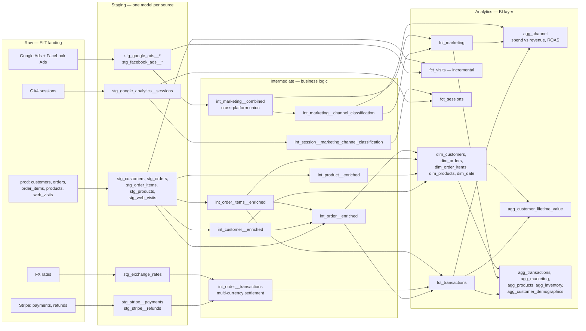

# dbt E-commerce Data Model

[](https://github.com/donovannevard/dbt-ecom-data-model/actions/workflows/dbt_ci.yml)

A production-shaped dbt project for e-commerce revenue, marketing spend and attribution: 40 models across `staging` → `intermediate` → `analytics`, 128 tests, SCD Type 2 snapshots, and a synthetic dataset that makes the whole thing run on your laptop in about ten seconds.

Builds on **DuckDB** with no credentials, targets **Snowflake** or **Redshift** in production through dispatched macros, and ships **optional orchestration** — Dagster built in, or drop it into your own Airflow — because dbt has no scheduler and `dbt docs` is a catalogue, not a control plane. The [warehouse support table](#warehouse-support) is explicit about which of those is actually executed in CI and which is not.

**Companion repo:** the Snowflake and Redshift warehouses this project was verified on were provisioned with [data-infrastructure-deployment](https://github.com/donovannevard/data-infrastructure-deployment): one `terraform apply` for the warehouse, least-privilege RBAC, Fivetran and Airflow. Together they cover the pipeline from infrastructure to modelled data.

**It actually runs.** No warehouse account, no credentials, no signup:

```bash
git clone https://github.com/donovannevard/dbt-ecom-data-model.git
cd dbt-ecom-data-model
make up
```

`make up` creates a virtualenv, installs dbt-duckdb, and builds 23 seeds, 40 models, 2 snapshots and 128 tests into a local DuckDB file — about ten seconds, and the same thing CI runs on every push. `make` on its own lists every target.

Prefer to drive it yourself:

```bash
python3 -m venv .venv && source .venv/bin/activate
pip install -r requirements.txt
dbt deps && dbt seed && dbt build
```

**No Python on your machine?** One command, nothing installed on the host:

```bash
docker compose up        # or: make docker-up
```

That builds the project inside the container, runs all 128 tests, and serves the documentation at **http://localhost:8080** — lineage graph, every model, every column description. CI runs this same path on every push, so it is a tested claim.

To see it as a scheduled pipeline rather than a documentation site:

```bash
docker compose --profile orchestration up    # Dagster at localhost:3000
```

## If you only have five minutes

Reviewing this quickly? These four files carry most of the engineering judgement:

| File | Why it's worth a look |
|---|---|
| [`models/analytics/agg_channel.sql`](models/analytics/agg_channel.sql) | The payoff model. Reports gross *and* margin-aware net ROAS, and documents why a channel can be profitable on one and not the other. |
| [`models/analytics/fct_transactions.sql`](models/analytics/fct_transactions.sql) | Refund proration across line items, currency conversion done in the right order, and cost of goods charged only on units kept. |
| [`snapshots/products_snapshot.sql`](snapshots/products_snapshot.sql) | A snapshot strategy chosen with a stated reason rather than defaulted. |
| [`macros/regexp_contains.sql`](macros/regexp_contains.sql) | Cross-warehouse dispatch, and the regex-grouping bug it exists to prevent. |
| [`orchestration/definitions.py`](orchestration/definitions.py) | Dagster assets, and the seed→source dependency dbt's own DAG cannot express. |
| [`orchestration/external/README.md`](orchestration/external/README.md) | The contract for running this from Airflow or anything else, with two tested reference DAGs. |

Then run `make up && make docs` — that builds everything and opens the lineage graph in your browser.

## Lineage

Sixteen raw tables land from an ELT tool. Staging normalises one source each; intermediate holds the business logic; analytics is the BI-facing layer.



Full interactive lineage, plus every column description, is one command away: `make docs`.

## Explore it yourself

Everything below works on a plain clone with no warehouse account.

**Browse the model graph and column docs.** This is the best way in — a navigable DAG plus every column description, including the shared definitions in `docs/doc_blocks.md`:

```bash
make docs          # builds a single self-contained HTML file and opens it
make docs-serve    # or serve it at localhost:8080 instead
```

`make docs` uses `dbt docs generate --static`, which bundles the whole site into one file (`target/static_index.html`). Nothing to keep running, no port to collide with, and the file can be sent to someone who has no dbt install.

**Run ad-hoc SQL.** `dbt show` resolves `ref()`, so you can query models by name without knowing their physical location:

```bash
make query Q="select * from {{ ref('agg_channel') }}"
make query Q="select category, sum(contribution_margin) c from {{ ref('fct_transactions') }} t join {{ ref('dim_products') }} p on t.product_id = p.id group by 1 order by c desc"

# or straight dbt, with a row cap
dbt show --inline "select * from {{ ref('agg_customer_lifetime_value') }}" --limit 10
```

**Run the saved analyses.** Three worked examples live in [`analysis/`](analysis/) — they are compiled by dbt but never materialised, which is what that folder is for:

```bash
dbt show --inline "$(cat analysis/channel_performance.sql)" --limit 10
dbt show --inline "$(cat analysis/top_products.sql)" --limit 10
```

`channel_performance.sql` is the one to read first — it answers "which channels actually pay for themselves" and labels unattributable channels separately rather than reporting them as zero.

**Open a real SQL shell.** The whole warehouse is one file, `dev.duckdb`:

```bash
brew install duckdb     # optional, macOS
make shell              # or: duckdb dev.duckdb
```

```sql
.tables
select * from main.agg_channel order by spend desc;
describe main.fct_transactions;
-- the demo's raw landing tables, standing in for an ELT tool's output
select * from extract.prod_orders limit 5;
```

**Poke at the pipeline itself.** This is where dbt's graph selection earns its keep:

```bash
dbt build --select fct_transactions+          # that model and everything downstream
dbt build --select +agg_channel               # everything agg_channel depends on
dbt test  --select fct_transactions           # just its tests
dbt build --select state:modified+ --state target   # only what you changed
```

**Break something on purpose.** The fastest way to see whether the tests are real:

```bash
# Inflate a product's cost above its price and watch margin tests react
make query Q="select id, price, unit_cost from {{ ref('dim_products') }} limit 5"
# then edit seeds/example/prod/prod_products.csv, and:
dbt seed --select prod_products && dbt build --select +agg_channel
```

**Regenerate the dataset.** The generator is deterministic — same seed, byte-identical CSVs — so this is safe to run and diff:

```bash
make regen-seeds && git diff --stat
```

**Check it configures on all three warehouses** (needs `pip install dbt-snowflake dbt-redshift`):

```bash
make parse-all
```

## Running it in Docker

The container path exists so that "it runs on my machine" is never the answer. A reviewer with Docker and nothing else gets the full project, built and documented, from one command:

```bash
docker compose up          # or: make docker-up
```

Then open **http://localhost:8080**. The container seeds, builds every model and snapshot, runs all 128 tests, generates the docs and serves them — roughly 25 seconds on a warm image. With `-d` you will not see the startup banner, so give it that long before expecting a response; the docs server starts *after* the build finishes.

The host port is configurable, for when 8080 is already taken (another project's Airflow, say):

```bash
DBT_DOCS_PORT=8081 docker compose up      # docs on http://localhost:8081
```

Inside the container the server is always on 8080; only the published port moves. The startup banner prints whichever host port you actually mapped.

**After editing `Dockerfile`, `docker/entrypoint.sh` or `requirements.txt`, rebuild:**

```bash
docker compose up -d --build       # or: make docker-build
```

Nothing is mounted from the host, so a plain `docker compose up` happily runs the previously-built image and your change appears to have done nothing.

The image also doubles as a dbt CLI, so you can work inside exactly the environment CI uses:

```bash
make docker-shell                         # interactive shell in the container
make docker-run CMD="dbt test"            # one command
docker compose run --rm cli dbt ls --resource-type model
docker compose run --rm cli sh -c "dbt seed -q && dbt build -q && dbt test"
docker compose down                       # stop
```

### Decisions in the Dockerfile worth noting

**Nothing is mounted from the host by default.** The project, its DuckDB database and `target/` all live inside the container. That is the point: what you see is what a clean clone produces, not what your machine happens to have lying around. A commented-out volume mount is there in `docker-compose.yml` for iterating on models, with a note that it shadows the image's `dbt_packages`.

**Layers are ordered cheapest-to-invalidate-last.** `requirements.txt` first, then `packages.yml` + `dbt deps`, then the project. Editing a model rebuilds one layer rather than reinstalling dbt.

**It runs as a non-root user** (uid 10001) that owns `/dbt`, because `target/` and the DuckDB file are written at runtime.

**The healthcheck uses HEAD, not GET.** dbt serves docs with Python's `SimpleHTTPRequestHandler`, and a GET whose body the check abandons early makes the server log a `ConnectionResetError` traceback on *every* check — the container works but the logs look broken. HEAD returns headers only, so the connection closes cleanly.

**`dbt docs serve --host 0.0.0.0`.** dbt binds to localhost by default, which inside a container means nothing outside it can reach the port. This is the single most common reason a containerised `dbt docs serve` appears to do nothing.

**`.dockerignore` excludes `.venv`, `target/` and `*.duckdb`** so a host-built database can never leak into the image and mask what it actually produces.

The image is ~790MB, which is ordinary for dbt — most of it is dbt-core and its dependency tree, not anything this project adds.

## Orchestration

**dbt has no scheduler, and `dbt docs` is not one.** This trips people up, so to be explicit: `dbt docs` is a static catalogue generated from `manifest.json` and `catalog.json` — models, columns, tests, lineage, compiled SQL. It is read-only. There is no button that runs anything, no run history and no alerting. dbt Core itself is a CLI that transforms data when something invokes it. That something is an orchestrator, and here it is Dagster.

**It is optional and swappable.** Delete `orchestration/` and the dbt project is untouched. Use the built-in Dagster setup, or wire the project into an Airflow instance you already run — both paths are documented and tested.

```bash
# Built-in: Dagster
make install-orchestration && make dagster     # UI at localhost:3000
make dagster-run                               # run the pipeline, no UI
docker compose --profile orchestration up      # or in Docker

# Your own orchestrator: see orchestration/external/
make verify-airflow-examples                   # import-check the Airflow DAGs
```

[`orchestration/definitions.py`](orchestration/definitions.py) loads every dbt model, snapshot and reference seed as a Dagster asset — 65 assets in total. The **Assets** tab shows the full graph from raw landing tables through to marts; **Automation** shows the schedule; each run records what was materialised and how long it took.

### What the orchestrator adds that dbt cannot do itself

This is the part worth understanding, because it is the actual argument for orchestration rather than a cron line.

The demo dataset in `seeds/example/**` stands in for ELT-landed raw tables, and staging models reach it through `source()` — exactly as they would against a real warehouse. **dbt therefore has no DAG edge from those seeds to the models that read them**, which is why `dbt seed` has to run before `dbt build`, and why a single `dbt build` against an empty database races them. That ordering lives in a README instruction and in a human's memory, which is precisely where load-bearing dependencies should not live.

Dagster fixes it properly. Those seeds materialise the same asset keys that dbt assigns to its sources, so declaring them as one upstream asset makes the dependency explicit:

```
raw_landing_tables  (16 assets, = dbt's source keys)
        │
        └──>  stg_orders, stg_customers, …  ──>  int_*  ──>  dim_/fct_/agg_*
```

`stg_orders` now genuinely depends on `extract.prod_orders`. Nothing downstream can start before the raw tables exist, the ordering is enforced by the graph rather than by documentation, and CI asserts that edge still exists.

### Tests become asset checks

dbt tests are picked up automatically as Dagster **asset checks**, so all 128 of them appear against the asset they guard rather than as a wall of CLI output. A failing `relationships` test shows as a failed check on that specific model, which is the difference between "the build failed" and "`fct_transactions` has orphaned `customer_id` values".

### The schedule

`daily_refresh` runs at 06:00 Europe/London — after an overnight ELT window would realistically land. Deliberately not hourly: nothing upstream changes that often, and a schedule that fires more often than its inputs change is noise and warehouse spend. It ships **disabled**; enable it in the Automation tab, since a cloned repo should not start running things on a timer by itself.

### Orchestration is optional, and swappable

**The dbt project has no dependency on any orchestrator.** Delete `orchestration/` and `dbt build` still works, CI still passes, and nothing in `models/`, `macros/` or `seeds/` changes. Dagster here is a convenience, not a coupling — because most clients already run something, and a dbt project that insists on its own scheduler has to be rewritten before it can be adopted.

Three routes, all documented in [`orchestration/external/README.md`](orchestration/external/README.md):

| Route | When it fits | What it takes |
|---|---|---|
| **Dagster, built in** | No orchestrator yet, or you want one scoped to this pipeline | `make dagster`. Nothing to stand up. |
| **Your existing Airflow** | The client already runs Airflow — the common case | Copy one env-var-driven DAG, or run this project's Docker image from `KubernetesPodOperator`. No changes to this repo. |
| **dbt Cloud** | Managed scheduling, no infrastructure appetite | Connect the repo; set a job's commands to `dbt seed --select path:seeds/example` then `dbt build`. `profiles.yml` is ignored — credentials live in its UI. |

The contract any of them needs is small: make packages available (`dbt deps`), ensure the raw tables exist, `dbt build --target <target>`, and set `DBT_PROFILES_DIR` plus warehouse credentials. Three commands and some environment.

Two things worth knowing before picking:

- **Airflow and dbt have conflicting dependency trees.** Installing dbt into an Airflow image is a known source of pain, which is why Cosmos ships virtualenv, Docker and Kubernetes execution modes. The cleanest integration is to let Airflow run [this project's container](#running-it-in-docker) — then there is no dependency contact at all.
- **dbt Cloud runs dbt and nothing else.** If the warehouse build has to be sequenced against ingestion, reverse-ETL or an ML step, that coordination lives elsewhere — and you end up with an orchestrator anyway, with dbt Cloud reduced to the thing it triggers.

### Why Dagster rather than Airflow

Worth being precise, because "Dagster is lightweight Airflow" is the common shorthand and it is not really true. The difference is the abstraction, not the weight:

- **Airflow is task-centric.** You declare operations and the dependencies between them. The DAG describes *work to do*, and Airflow does not inherently know what data any task produced.
- **Dagster is asset-centric.** You declare *data assets* — tables — and their dependencies, and the computation is a detail of how each asset gets built. Dagster therefore knows "this run materialised `stg_orders`".

That second model is why dbt maps onto Dagster so directly: dbt is asset-centric too, a model *is* a table. It gives asset-level lineage, "rebuild this model and everything downstream" as a first-class operation, dbt tests surfacing as asset checks, and freshness policies per table. Airflow reaches the same place through an adapter — Cosmos translating dbt's model graph into tasks — and Airflow 3's Assets have narrowed the gap considerably.

So the honest summary:

| | Airflow | Dagster |
|---|---|---|
| Ubiquity | Far more widely deployed; what most clients run | Growing, commonest in newer data teams |
| Strength | Orchestrating heterogeneous work — Spark, APIs, k8s, file moves | Data-asset lineage, local development, testing |
| dbt integration | Via astronomer-cosmos | First-class, built on the manifest |
| To stand up a demo | Webserver + scheduler + metadata database | One process |

Dagster is the *built-in* option here for the last row: a demonstration has to actually run, and a reviewer cloning this repo should not have to provision Postgres to see anything. It also means the orchestrator view and the data-model view are the same picture, which is the thing worth showing.

None of that is an argument that Dagster is the right choice for a client who already runs Airflow — which is exactly why the Airflow path is documented and parse-checked rather than hand-waved.

### What a real deployment would change

`dagster dev` runs the webserver and daemon in one process, which is right for local use and for a demo, and wrong for production. A real deployment runs `dagster-webserver` and `dagster-daemon` as separate long-lived services against Postgres rather than the local SQLite instance, and executes runs in containers (`k8s_job_executor` or ECS) rather than as subprocesses. The asset definitions themselves do not change.

## Design decisions

The parts worth arguing about, and why they went the way they did.

### Why the layers split where they do

**Staging does exactly one thing per source table**: rename to the project's conventions, cast types, and nothing else — no joins, no filters, no business logic. That makes every staging model a mechanical, reviewable mapping from a vendor's schema to ours, and it means swapping Stripe for Adyen touches one file. Staging is materialised as views: free to rebuild, no storage, and the cost of a view over a small source table is irrelevant.

**Intermediate is where the business decisions live** — currency settlement, click attribution, cross-platform unions. These are tables, because they are joined repeatedly downstream and are the expensive part of the graph.

**Analytics is the only layer a BI tool should ever point at.** `dim_`/`fct_`/`agg_` prefixes are load-bearing: a dimension is a conformed entity, a fact is one row per business event, an aggregate is pre-computed because someone would otherwise compute it wrong.

### Attribution

Orders and web visits both carry a Google Click ID. `parse_gclid_ad_id` resolves it back to an ad → ad group → campaign, so revenue in `fct_transactions` and visits in `fct_visits` join directly to spend in `agg_marketing`. That join is the entire reason a marketing data model exists, and it is the thing most e-commerce warehouses get wrong by keeping spend and revenue in separate, un-joinable tables.

`agg_channel` puts spend, clicks, revenue and ROAS side by side per channel — and reports **two** ROAS figures, which is the point of the table:

- **`gross_roas`** — attributed revenue before returns, per unit of spend. The number ad platforms report and most dashboards show.
- **`net_roas`** — contribution after returns *and* cost of goods, per unit of spend. The number that decides whether a channel deserves budget.

In the demo dataset those diverge sharply, which is the realistic case:

| Channel | Spend | Gross ROAS | Net ROAS |
|---|---:|---:|---:|
| Brand | £577 | 3.01 | 2.25 |
| Shopping | £447 | 2.29 | 1.53 |
| Non Brand | £233 | 1.77 | 1.25 |
| **Display** | **£1,207** | **1.45** | **0.57** |

Display looks like it returns £1.45 per £1 spent. After a 17% return rate and cost of goods it returns 57p — it is the largest line of spend in the account and it is losing money. A channel report built only on the platform-reported number cannot show that, which is why cost of goods is carried all the way from `prod_products.unit_cost` through to `fct_transactions.contribution_margin`. Channel groupings come from a seed (`seeds/marketing_channel_taxonomy.csv`) matched by regex, so both GA4 sessions and ad-platform campaigns classify through the same taxonomy — and a marketer can change the grouping with a CSV edit and `dbt seed`, with no code change and no engineer.

**Known limit, by design:** the revenue side of `agg_channel` is gclid-based, so it is Google-only. Facebook, organic, email and referral revenue is not attributed — there is no cross-platform click-id equivalent and no session-to-order join in this dataset. Social shows spend with zero attributed revenue for exactly this reason. Inventing a number there would be worse than showing the gap.

### Incrementality

`fct_visits` is incremental with an explicit `unique_key` and `merge` strategy, because raw visit events are an ever-growing append-mostly log. `fct_sessions` is not — GA4 sessions arrive pre-aggregated and get restated by Google after the fact, so a full refresh is both cheap and more correct.

That contrast is the actual point. Incremental is not a performance setting you sprinkle on large tables; it is a claim that history does not change, and it is wrong whenever the upstream source restates.

### Multi-currency

Stripe settles in the customer's local currency. `int_order__transactions` converts every payment and refund back to a single reporting currency at the rate for the transaction date, and FX rates are snapshotted as SCD Type 2 so a rebuild reproduces yesterday's numbers rather than silently restating them with today's rate. The reporting currency is a var, not a hardcoded `'GBP'`.

### Snapshot strategies are chosen, not defaulted

`currency_rates_snapshot` uses the `timestamp` strategy because the source carries a genuine load timestamp. `products_snapshot` uses `check` on `price`, because its source is a daily snapshot of the current catalogue — a timestamp strategy would cut a new SCD2 version every single day whether or not the price moved, and the table exists to record price *changes*.

### Custom schemas are absolute

`macros/generate_schema_name.sql` overrides dbt's default, which prefixes custom schemas with the target schema and would turn `extract` into `test_extract`. The demo seeds impersonate an ELT landing area that a real deployment calls `extract`, and `models/sources.yaml` says so.

The consequence is deliberate: **environments separate by database, not by schema prefix.** Point dev, CI and prod at their own databases. Sharing one would let their seeds and snapshot history collide.

### Testing

128 tests, placed where they earn their keep rather than sprayed across every column:

- `relationships` on every fact-to-dimension foreign key — the tests that catch a broken join before a dashboard does
- `accepted_values` on status and category columns, where an unexpected value means an upstream schema change
- Five custom generic tests in `tests/generic/`: `positive_value`, `range_check`, `not_null_if_active`, `unique_if_active`, `accepted_values_if_status`. The conditional ones exist because real constraints are conditional — a campaign name must be unique among *active* campaigns, but may legitimately be reused after the original is archived
- `dbt_utils` `expression_is_true`, `unique_combination_of_columns` and `at_least_one` for grain and invariant checks
- Source freshness thresholds on `models/sources.yaml`, tighter for the raw event log than for batch-loaded sources

- `expression_is_true` invariants on the things that must hold by construction: `net_revenue <= gross_revenue`, `contribution_margin <= net_revenue`, and lifetime value reconciling to gross minus refunds. The contribution one earned its place immediately — it caught a negative cost of goods arising from an FX-rounding edge case on fully refunded foreign-currency orders

`store_failures` is on, so a failing test leaves the offending rows in the warehouse to inspect rather than just a count.

### Documentation lives next to the definition, once

Column descriptions that matter are written as `` blocks in [`docs/doc_blocks.md`](docs/doc_blocks.md) and referenced with `{{ doc('...') }}`, rather than retyped per model. The definitions of gross vs net ROAS, what the gclid attribution does and does not cover, and how reporting currency works are each stated in exactly one place and render identically everywhere they appear in `dbt docs`.

Descriptions explain business meaning and limits, not column names. `attributed_orders` does not say "the number of attributed orders" — it says which channels attribution can and cannot cover, and that it undercounts rather than estimates. A description that restates the column name is worse than none, because it looks like documentation while answering nothing.

### Why seeds load separately from `dbt build`

The demo data is loaded by `dbt seed` before `dbt build`, not as part of it. The seeds in `seeds/example/**` stand in for ELT-landed raw tables, and staging models reach them through `source()` — exactly as they would against a real warehouse, where those tables are produced by Fivetran and not by dbt at all. dbt therefore has no DAG edge from those seeds to the models that read them, so a single `dbt build` on an empty database would race them.

Keeping `source()` rather than pointing staging at `ref()` is the right trade: the models stay honest about what is dbt's responsibility and what is the loader's, and moving to real client data is a change to `sources.yaml` alone.

## Warehouse support

| Target | Warehouse | Role | Verified how |
|---|---|---|---|
| `dev` *(default)* | DuckDB | Local dev, exploration, CI | **Fully executed.** Every model, snapshot and test runs on every push |
| `ci` | DuckDB | GitHub Actions | **Fully executed** |
| `snowflake_prod` / `snowflake_dev` | Snowflake | Production | **Fully executed**, 2026-10-05 |
| `redshift_prod` / `redshift_dev` | Redshift | Production | **Fully executed**, 2026-10-05 |

All three have been run end to end — full build, all 128 tests, the incremental merge path on a second run — and their output reconciled against each other. The Snowflake and Redshift runs used warehouses deployed by [data-infrastructure-deployment](https://github.com/donovannevard/data-infrastructure-deployment):

| | DuckDB | Snowflake | Redshift |
|---|---|---|---|
| Gross ROAS / Net ROAS | 2.0000 / 1.2009 | 2.0000 / 1.2009 | 2.0000 / 1.2009 |
| `fct_visits` total / attributed / anonymous | 900 / 283 / 550 | 900 / 283 / 550 | 900 / 283 / 550 |
| `dim_date` rows | 13,149 | 13,149 | 13,149 |
| Channels classified | 6 | 6 | 6 |

Credentials are never in the repo: `profiles.yml` is committed but every warehouse value is an `env_var()` reference. Copy the template for the warehouse you are targeting — [`.env.snowflake.example`](.env.snowflake.example) or [`.env.redshift.example`](.env.redshift.example) — to `.env.snowflake` / `.env.redshift`, then select it per run:

```bash
ENV_FILE=.env.snowflake make verify-warehouse TARGET=snowflake_prod
```

`make check-env TARGET=snowflake_prod` lists exactly which variables a target needs, which are missing, and which still hold a placeholder. Note that **dbt Core does not read `.env` files** — the `make` targets source it for you, but a bare `dbt build` needs the variables exported.

[`docs/warehouse-verification.md`](docs/warehouse-verification.md) is the procedure for closing that gap when a real warehouse is reachable — `make verify-warehouse-smoke TARGET=...` builds only the dialect-sensitive models first, so a dialect problem surfaces in minutes rather than after a full build.

DuckDB runs on every push in CI. Snowflake and Redshift were each executed once against a real account, which CI cannot do without credentials — CI instead installs both adapters and parses the project against each target, so a missing `redshift__` implementation or an invalid config still fails the build.

**Running against real warehouses was worth doing, and is the argument for never trusting a parse.** It found three classes of bug that no amount of config validation would have surfaced, and every one of them was invisible on DuckDB.

**Redshift — compute-node restrictions.** Both of these work when Redshift can fold the expression to a constant on the leader node, and fail against real joined tables. A scratch `SELECT` would have reported success:

1. **A regex pattern cannot come from a column.** The channel taxonomy was joined to its seed and matched with `~ (… || pattern || …)`. Redshift rejects that — and so do `REGEXP_INSTR`, `REGEXP_COUNT` and `SIMILAR TO`, all four verified against the cluster. The taxonomy is now compiled into a `CASE` of literal patterns at build time ([`macros/classify_by_taxonomy.sql`](macros/classify_by_taxonomy.sql)), which also removed the `ROW_NUMBER` window that picked the longest match — `CASE` branches emitted longest-first resolve the same way by construction.
2. **Month and year interval arithmetic fails on a column.** `DATE_TRUNC('year', date_day) + INTERVAL '1 year'` errors with "Interval values with month or year parts are not supported". Day intervals are fine. Now `{{ dbt.dateadd(...) }}` → `DATEADD`.

**Snowflake — identifier case folding.** Five models failed with `invalid identifier '"date"'`. Snowflake folds unquoted identifiers to **upper** case and preserves quoted ones exactly; DuckDB and Redshift fold to lower case, so a project that mixes `AS "date"` with a later unquoted `date` works on two warehouses out of three and is silently broken on the third. All SQL identifier quoting has been removed so every adapter folds consistently — the only remaining double quotes in the SQL are Jinja string delimiters.

No fix required per-warehouse SQL: all of it landed in dispatched macros, one model expression and the identifier convention. DuckDB output was re-verified byte-identical after each change.

Everything else is plain ANSI. Four constructs differ enough between the three to need dispatch, and all four are isolated in `macros/` so a fourth warehouse means editing those files and nothing else:

| Macro | The problem |
|---|---|
| `regexp_contains.sql` | Snowflake uses `REGEXP_LIKE`; DuckDB and Redshift use POSIX `~`. The pattern is padded with `.*` and *grouped* while padding, because `'.*' || 'a|b' || '.*'` parses as `(.*a)|(b.*)` and silently matches nothing. The pattern must be a literal — see the Redshift finding above |
| `date_names.sql` | DuckDB has no `TO_CHAR` and uses `STRFTIME`. Redshift has `TO_CHAR` but blank-pads the output, so every variant is `TRIM`-wrapped. Snowflake's format strings differ from Postgres', and it has no full-weekday-name format at all — that one is an explicit `CASE` mapping |
| `safe_cast_integer.sql` | DuckDB and Snowflake have `TRY_CAST`. Redshift has no equivalent and a failed `CAST` aborts the query, so there the value is regex-guarded before casting |
| `generate_schema_name.sql` | Not a dialect difference, but the one config override that changes behaviour everywhere: custom schemas are absolute rather than prefixed |

Two further portability decisions that are not macros:

- **`CONCAT_WS` is avoided entirely.** Redshift does not have it. `COALESCE(...) || '-' || COALESCE(...)` works on all three and makes the NULL handling explicit rather than implicit.
- **Seed column types are declared, not inferred** ([`seeds/example/example_seeds.yaml`](seeds/example/example_seeds.yaml)). Each adapter applies its own CSV inference, and a column landing as `INTEGER` on one warehouse and `VARCHAR` on another changes what the staging layer's casts and NULL handling actually do. The two nullable columns that matter — `prod_web_visits.customer_id` for anonymous visits and the `gclid` columns for organic traffic — must arrive as NULL rather than `0` or `''`, or attribution coverage silently shifts.

### A note on Redshift specifically

A production Redshift deployment should add `dist` and `sort` configs to the large fact tables. None are set here deliberately: the right distribution key depends on the cluster's node count and the queries actually run against it, and a wrong `DISTKEY` is materially worse than none at all — it skews storage and forces broadcast joins. `fct_transactions` would most likely want `dist='order_id'` with `sort='order_date'`, and `fct_visits` `sort='visited_at'`, but that is a decision to make against a real cluster and a real query log, not to guess in a template.

## What's in it

- **Revenue and margin**: a custom `prod` database (customers, orders, order_items, products) plus Stripe payments and refunds — the full order → payment → refund → net revenue → contribution pipeline, multi-currency throughout. Product cost carries through to line-level cost of goods, charged only on units actually kept, so returned stock is not counted as a cost.
- **Marketing spend**: Google Ads (campaigns → ad groups → ads → daily cost) and Facebook Ads (campaigns → ad sets → ads), unified in `int_marketing__combined`.
- **Attribution and channel reporting**: as above.
- **Customer lifetime value**: `agg_customer_lifetime_value` computes historical LTV plus a 1/3/5-year projection from average order value × purchase frequency, held constant. That is a deliberate baseline, not a model — it is the right starting point before there is enough order history to fit a retention curve, and it is meant to be replaced by a cohort model once there is.
- **Reference data**: ISO country codes, currency metadata, time zones, UK/IE bank holidays 2015–2030, UK postcode districts, and the channel taxonomy — populated, not stubs.
- **Macros**: `safe_divide`, `parse_gclid_ad_id`, `cents_to_currency`, `pct_change`, `fiscal_year`/`fiscal_quarter` wired into `dim_date`, plus the two portability macros above.

### The demo dataset

`seeds/example/**` is synthetic and regeneratable via `scripts/generate_example_seeds.py`: 40 customers, 150 orders, 304 order items, payments and refunds in five currencies, ad-platform performance, GA4 sessions and 900 web visits, all referentially consistent so every `relationships` test passes for real rather than vacuously.

It is obviously fake, but its economics are calibrated rather than arbitrary. **Ad spend is derived from order revenue, not generated independently** — the generator resolves each order's gclid to a campaign, then back-solves that campaign's spend so blended gross ROAS across the attributable channels lands on a target (2.0). Per-campaign efficiency is deliberately uneven, with brand search earning most per pound and display least, because a dataset where every channel returns exactly the same multiple is transparently synthetic.

Net ROAS is *not* dialled in. It falls out of two trading facts — a 17% return rate and a 72% blended gross margin, both ordinary for apparel — which together put contribution at ~60% of gross revenue and so turn a 2.0 gross ROAS into a 1.2 net ROAS. Change the margin table or the return rate in the generator and net ROAS moves accordingly, as it should.

Cost per click, click-through rate and platform-reported conversions are set per campaign at roughly realistic Google Ads levels (brand search cheap and high-CTR, display cheap and barely clicked), and reported conversions modestly overcount real attributed orders, as every ad platform does.

**Known remaining inconsistency:** the generator produces ~6,700 Google ad clicks against only 900 first-party web visits. Those should be closer in a real account. Raising the visit count fixes it at the cost of a much larger seed file; it is left small deliberately to keep the clone light.

## Pointing it at real data

1. Replace the tables in `models/sources.yaml` with the client's raw schema, and stop running `dbt seed` for `seeds/example/**`.
2. Add a source: copy the closest staging folder — `staging/marketing/google_ads/` for another ad platform, `staging/commercial/stripe/` for another processor — and adapt the column list.
3. Set `vars.reporting_currency` and `vars.fiscal_year_start_month` in `dbt_project.yml`.
4. Edit `seeds/marketing_channel_taxonomy.csv` for the client's campaign naming convention. Campaign classification pattern-matches campaign names, which assumes a convention like `Google Brand Search`; a client without one needs an explicit campaign-to-channel mapping seed instead.
5. Remove an unused source by deleting its staging folder — nothing downstream of other sources is affected.

A subscription or B2B client needs a genuinely different intermediate layer (MRR and churn, or leads → opportunities → closed-won). That is a per-client build, not something to generalise here.

## Project structure

```
Makefile              # make up / docs / query / docker-up / fresh — start here
requirements.txt      # dbt-core + dbt-duckdb; prod adapters commented
profiles.yml          # Committed. DuckDB default, no credentials in it
.env.snowflake.example   # Credential template per warehouse; copy to
.env.redshift.example    #   .env.snowflake / .env.redshift (both gitignored)
Dockerfile            # Two stages: `dbt` (default) and `orchestration` (+ Dagster)
docker-compose.yml    # up -> docs on 8080; --profile orchestration -> Dagster on 3000
docker/
├── entrypoint.sh     #   dbt image: build then serve docs
└── entrypoint-dagster.sh  # orchestration image: parse then start Dagster
.dockerignore         # Keeps host .venv / target / *.duckdb out of the image
orchestration/        # Optional. Delete it and the dbt project is unaffected
├── definitions.py    #   Dagster assets, schedule, and the seed->source edge
└── external/         #   Hooking into an orchestrator you already run
    ├── README.md     #     The integration contract: 3 commands + env
    ├── airflow_cosmos_dag.py  # One Airflow task per dbt model (50 tasks)
    ├── airflow_bash_dag.py    # Three BashOperator tasks, no extra deps
    └── parse_check.py         # Imports both and asserts their shape
requirements-orchestration.txt  # Dagster, kept out of the core install
models/
├── staging/          # One model per source table. Views. Rename and cast only.
│   ├── commercial/   #   Stripe, GA4, FX rates
│   ├── marketing/    #   Google Ads, Facebook Ads
│   └── prod/         #   Customers, orders, products, web visits
├── intermediate/     # Business logic: enrichment, currency, attribution, unions
├── analytics/        # BI layer: dim_, fct_, agg_
└── sources.yaml      # Raw table declarations + freshness thresholds
seeds/
├── *.csv             # Reference data
└── example/
    ├── **/*.csv      # Synthetic demo dataset
    └── example_seeds.yaml   # Declared column types — cross-warehouse determinism
snapshots/            # SCD Type 2: FX rates, product pricing
macros/
├── generate_schema_name.sql # Custom schemas are absolute, not prefixed
├── regexp_contains.sql      # Portability: regex matching
├── date_names.sql           # Portability: month/weekday names
├── safe_cast_integer.sql    # Portability: TRY_CAST equivalent
└── *.sql                    # Business macros: safe_divide, parse_gclid_ad_id, …
docs/
├── doc_blocks.md     # Shared column definitions, referenced via {{ doc() }}
└── warehouse-verification.md  # Procedure for testing on real Snowflake/Redshift
tests/generic/        # Five custom generic tests
analysis/             # Three worked analyses, compiled but never materialised
scripts/              # generate_example_seeds.py — deterministic
```

## Licence

MIT — see [LICENSE](LICENSE).

Built by Donovan Nevard.
